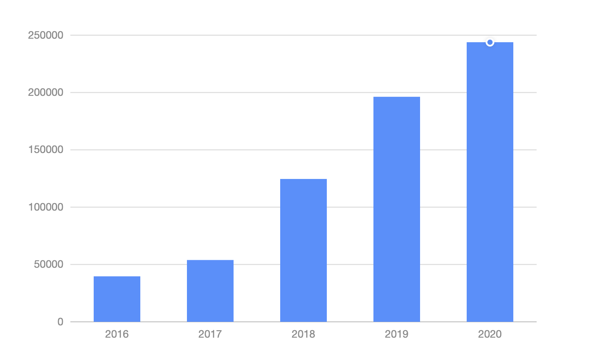
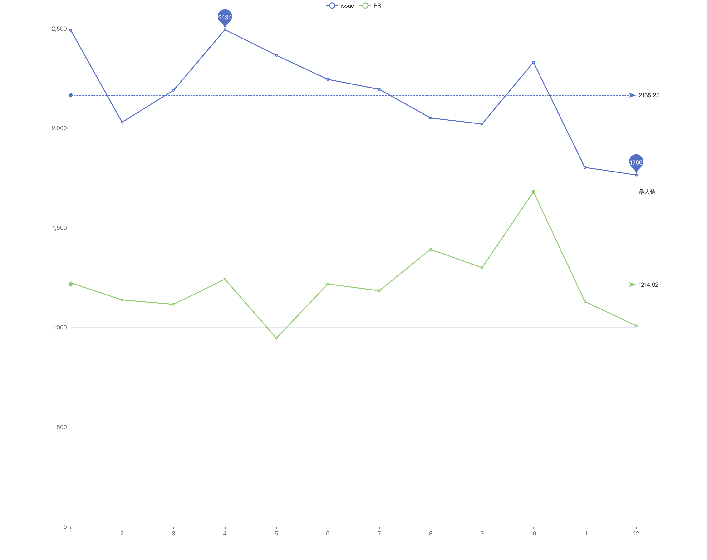
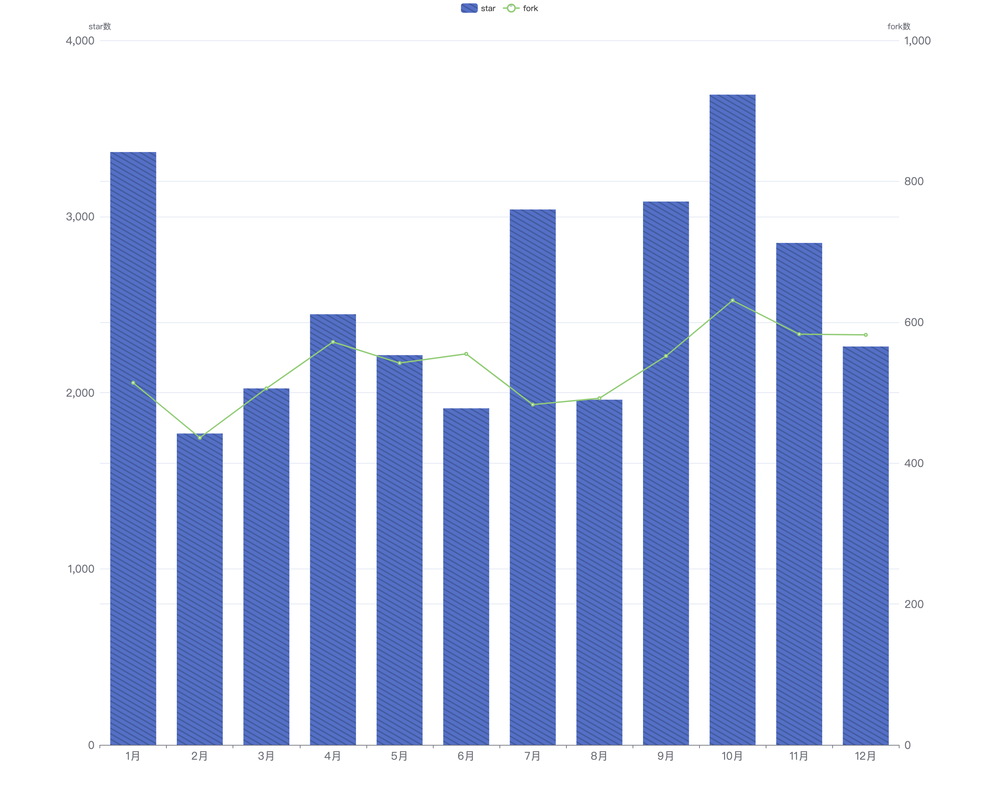
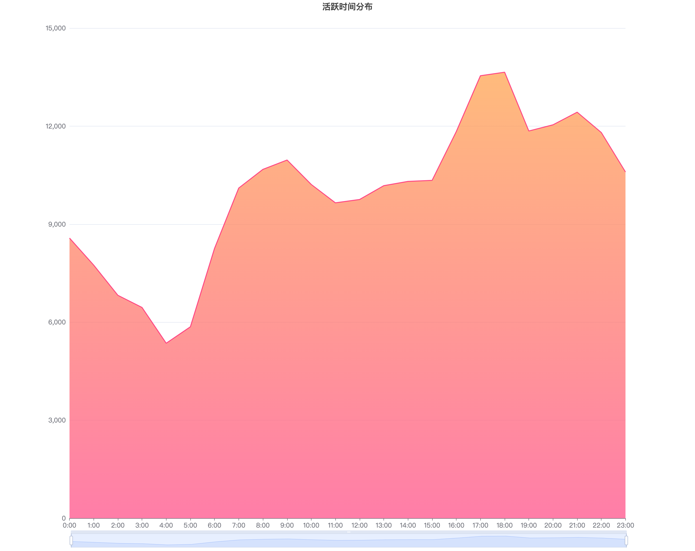
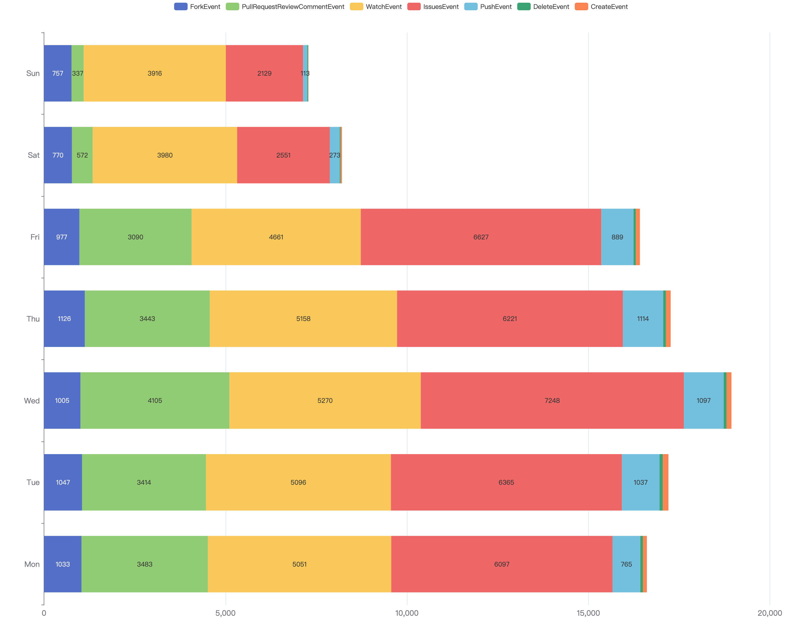

# 2020年Flutter项目数据分析及社区分析

## 1. 引言
Flutter是谷歌的移动UI框架，可以快速在iOS和Android上构建高质量的原生用户界面。
Flutter可以与现有的代码一起工作。
在全世界，Flutter正在被越来越多的开发者和组织使用，
本报告将分析2020年Flutter项目数据和社区动态。

## 2. 数据分析

2020最活跃的前十个项目
|  序号  | 项目 | 
| :---: | :--: |
|   1   | pddemo/demo |  
|   2   | google-test/signcla-probe-repo |  
|   3   | test-organization-kkjeer/app-test |  
|   4   | elastic/kibana |  
|   5   | test-organization-kkjeer/bot-validation |  
|   6   | ouyanxia2/hgmgmg |   
|   7   | imamandrews/imamandrews.github.io |  
|   8   | kubernetes/kubernetes |  
|   9   | flutter/flutter |  
|   10  | NixOS/nixpkgs |  

flutter/flutter是2020年最活跃的十个项目之一，全年共打开了issus数**17538**，新增star数**33130**，fork数**6714**。2020年flutter日志总数为**243853**，下图展示flutter项目近五年日志数的趋势图，可以看出，该项目自2018年以来活跃度显著增加。

<!-- 243853 196270 124601 53908 39683 -->
<!-- 活跃开发者账号数 -->

### 2.1基础数据统计
- 2020年Flutter项目每月提出的issue数和PR数

- 2020年Flutter项目每月start数和fork数

### 2.2开发者数据统计
- Flutter项目活跃时间分布

- 开发者在一周中各事件的贡献度

## 3. 流程分析

## 4. 总结

